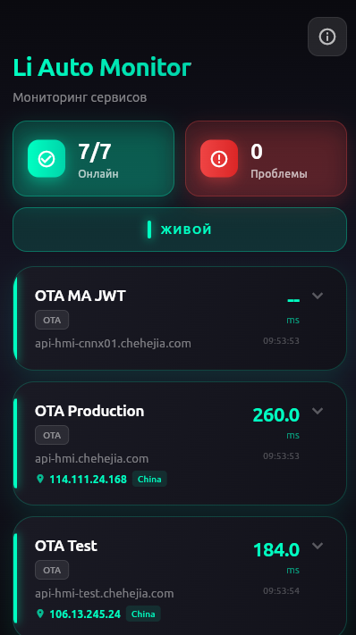
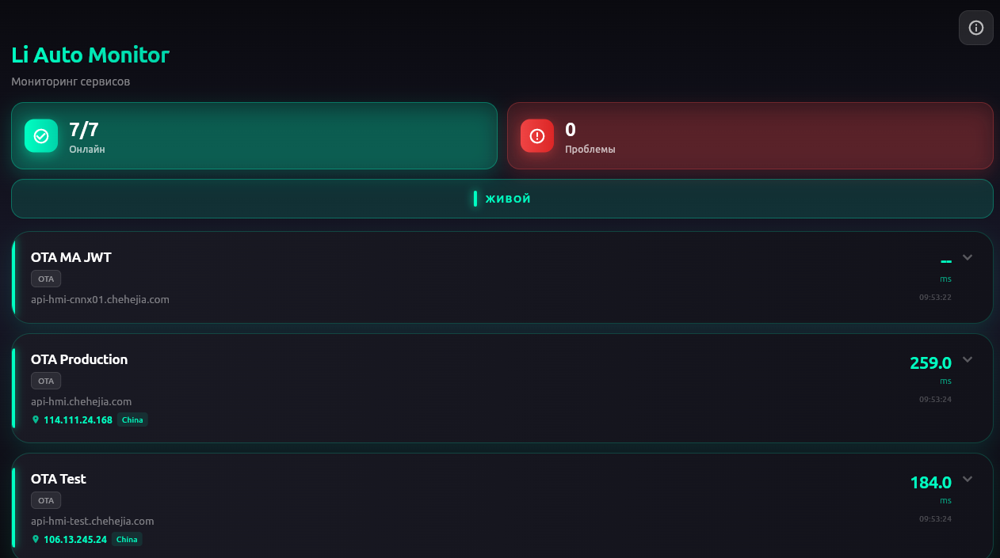

#  Li Auto Monitor

Программно-диагностический комплекс для глубокого анализа сетевой инфраструктуры **Li Auto** (сервисы OTA, подсистемы авторизации и телеметрии). В отличие от тривиальных методов проверки доступности, приложение реализует имитацию реальных паттернов трафика через TCP-трассировку, что позволяет идентифицировать деградацию связи на уровне прикладных протоколов даже за многоуровневыми межсетевыми экранами.

  
  

---

## 🏗 Развертывание и Бинарные файлы

Используйте актуальные сборки для вашей целевой платформы:

### 📱 Мобильные платформы
*   **Android:** [Загрузить LiAutoMonitor.apk (Stable)](https://github.com/seoeaa/li_auto_monitor/releases/latest/download/app-release.apk)
*   **iOS (Preview):** [Загрузить LiAutoMonitor.ipa](https://github.com/seoeaa/li_auto_monitor/releases/latest/download/LiAutoMonitor.ipa)
    *   *Техническая заметка:* Для развертывания на iOS рекомендуется использование контейнера [SideStore](https://sidestore.io/). В среде Linux установка возможна через [AltServer-Linux](https://github.com/NyaMisty/AltServer-Linux).

### � Десктопные системы
*   **Windows x64:** [LiAutoMonitor-Windows.zip](https://github.com/seoeaa/li_auto_monitor/releases/latest/download/LiAutoMonitor-Windows.zip)
*   **Linux (tar.gz):** [LiAutoMonitor-Linux.tar.gz](https://github.com/seoeaa/li_auto_monitor/releases/latest/download/LiAutoMonitor-Linux.tar.gz)

---

## 🛠 Ключевой функционал

*   � **Анализ графа маршрутизации:** Поузловая визуализация каждого прыжка (hop) с детальной метрикой задержек.
*   🗺️ **Профилирование GeoIP & ISP:** Автоматическая корреляция сетевых узлов с географическим местоположением и данными автономных систем (ASN).
*   � **Инспекция TCP SYN:** Верификация доступности портов (`443`) для имитации TLS-рукопожатий, что критично для современных HTTPS-сервисов.
*   � **Сегментированная диагностика:** Автоматическое распределение хостов по функциональным зонам (Обновления / Сервисы владельца).

---

## 📡 Методология верификации

Комплекс применяет эшелонированный алгоритм анализа:

1.  **L4 TCP Handshake:** Инициализация TCP-соединения на порту `443`. Позволяет выявлять блокировки на уровне DPI (Deep Packet Inspection).
2.  **L3 ICMP Metrics:** Базовое измерение RTT для оценки физического состояния канала.
3.  **Advanced TCP Traceroute:** Инкрементальное изменение TTL в TCP SYN пакетах для построения полной карты маршрута до целевого сервера.
4.  **Аналитическая визуализация:** Локализация точек отказа (Edge-узлы РФ, транзитные магистрали или пограничные шлюзы КНР).

---

## 📊 Диагностические показатели

Для упрощения мониторинга ресурсы разделены на два домена:

1.  **Инфраструктура OTA:** Группа `api-hmi`, обеспечивающая доставку обновлений прошивки автомобиля.
2.  **Сервисы мобильного приложения (APP):** Стэк серверов, отвечающих за авторизацию (`id.lixiang.com`) и работу основного функционала приложения (`api-app.lixiang.com`).

### Состояние узлов
*   🟢 **OPERATIONAL** — Канал связи корректен, задержки в пределах нормы.
*   🔴 **CRITICAL / PACKET LOSS** — Зафиксирована блокировка пакетов или таймаут ответа.

> [!IMPORTANT]
> **Локализация инцидента:**
> - Если деградация наблюдается на узлах с кодом **CN (China)** — активна фильтрация на внешнем шлюзе КНР (Great Firewall).
> - Если сбой фиксируется на узлах **RU (Russia)** — ограничения наложены локальным провайдером или магистральными сетями внутри РФ.

---

## 🧪 Стек технологий

*   **Runtime:** Flutter SDK (Multi-platform orchestration)
*   **Network:** Low-level TCP Socket Simulation logic
*   **Data:** Integration with Geospatial IP databases
*   **UI/UX:** Material Design 3 (Adaptive interface)

---

## 🤝 Обратная связь и разработка

Техническая поддержка и обсуждение в Telegram: [**@slaveaa**](https://t.me/slaveaa)

---

## ⚖️ Лицензия

Данное программное обеспечение распространяется на условиях открытой лицензии **MIT**. См. файл [LICENSE](LICENSE) для ознакомления с полным текстом.
