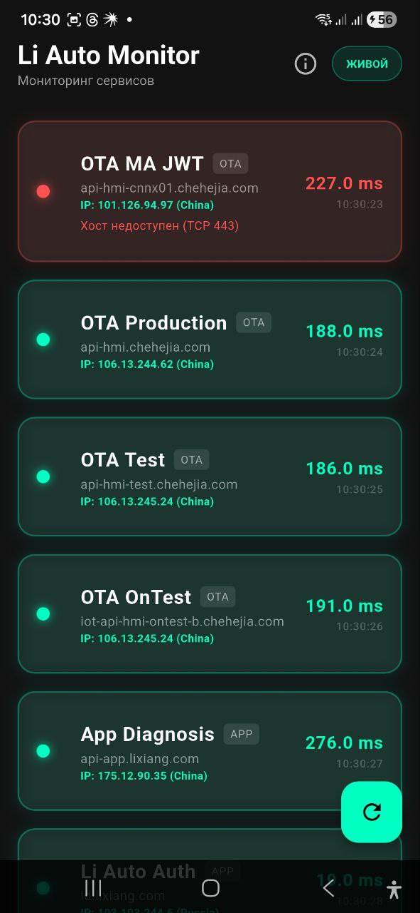
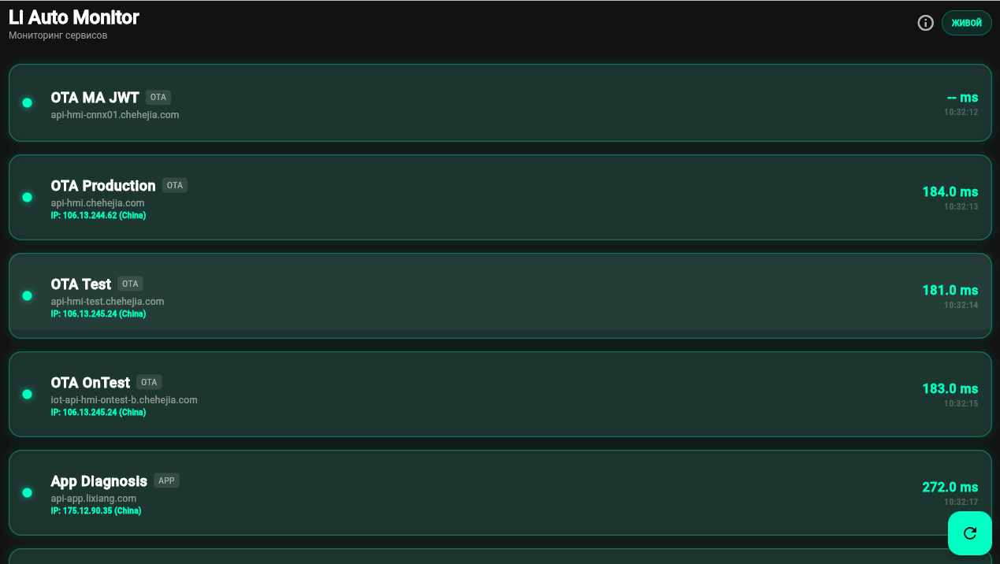

# Li Auto Monitor

Эта программа выполняет анализ соединения с серверами Li Auto (OTA, авторизация, диагностика). В отличие от обычного "пинга", она использует TCP-трассировку, имитируя реальный трафик приложений, что позволяет находить проблемы даже за сложными фаерволами.

## 📥 Скачать
### Android
Вы можете скачать последнюю версию приложения здесь:
**[LiAutoMonitor.apk](https://github.com/seoeaa/li_auto_monitor/releases/latest/download/app-release.apk)**

### iOS (BETA)
Для iOS доступна экспериментальная сборка:
1. Скачайте **[LiAutoMonitor.ipa](https://github.com/seoeaa/li_auto_monitor/releases/latest/download/LiAutoMonitor.ipa)**.
2. **Для Linux пользователей**: Используйте **[AltServer-Linux](https://github.com/NyaMisty/AltServer-Linux)** или **SideServer-Linux** для первой установки.
3. После установки **SideStore** на телефон, вы сможете обновлять приложение прямо с iPhone без компьютера (через Wi-Fi).

### Desktop
- **Windows**: **[LiAutoMonitor-Windows.zip](https://github.com/seoeaa/li_auto_monitor/releases/latest/download/LiAutoMonitor-Windows.zip)**
- **Linux**: **[LiAutoMonitor-Linux.tar.gz](https://github.com/seoeaa/li_auto_monitor/releases/latest/download/LiAutoMonitor-Linux.tar.gz)**

## ✨ Возможности

- **Проводит анализ маршрута**: Показывает каждый узел (hop) на пути к серверу.
- **GeoIP**: Определяет страну и провайдера для каждого узла.
- **Обход блокировок**: Использует TCP SYN пакеты (порт 443) для проверки реальной доступности.

## ⚙️ Как это работает

Приложение использует многоуровневый подход для проверки доступности:

1. **TCP Port Check**: Проверяет открытие порта `443` (HTTPS) — основной метод для современных сервисов.
2. **ICMP Ping**: Измеряет задержку (RTT) до сервера.
3. **Traceroute (по клику)**: Позволяет отследить весь путь пакета. При клике на карточку запускается трассировка с анализом каждого узла.
4. **GeoIP Анализ**: Для каждого прыжка (hop) запрашивается местоположение и провайдер (ISP), что позволяет точно определить, на какой стороне (РФ, транзит или КНР) произошел обрыв.

## 📊 Как читать отчет

Программа разделяет сервисы на две категории:

### 1. Сервисы Обновления (OTA)
Это сервера, откуда машина скачивает прошивки (api-hmi).
- **Production**: Основной сервер для всех клиентов.
- **Test / Dev**: Сервера для разработчиков и бета-тестеров.

### 2. Сервисы мобильного приложения (APP)
Сервера, отвечающие за работу мобильного приложения, цифрового ключа и авторизации.

## 🟢 Статусы

- **ONLINE (OK)** — Сервер доступен, связь стабильна.
- **DOWN (ОБРЫВ)** — Связь прервалась.

> [!IMPORTANT]
> Смотрите колонку "Диагноз / Место сбоя".
> - Если обрыв на узлах с локацией **CN (China)** — проблема в Китайском фаерволе (GFW).
> - Если обрыв на узлах **RU (Russia)** — проблема у локального провайдера.

## 🛠 Технологии

- Flutter (Android & Linux)
- TCP Trace Simulation
- Real-time Monitoring

## Разработчик

Telegram: [@slaveaa](https://t.me/slaveaa)

## Лицензия

MIT
